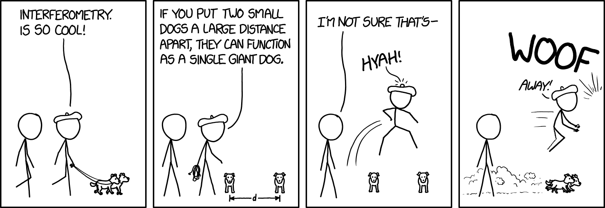

# verdant-shores 🏞️

A data acquisition software for the 40-foot radio telescope in the [National Radio Astronomy Observatory](https://public.nrao.edu/). This software is part of the [ERIRA](https://www.danreichart.com/erira) program. 

## Dependencies

We uses `PyQt5` for GUI and `pySerial` for communication to the data collection hardware (DataQ)

## Setting Up

You will need to create a Python 3.7.6 virtual environment, such as through `venv` or `virtualenv`

Set up the virtual environment, choosing virtualenv or venv
```
$ virtualenv env --python=python3
```
```
$ python -m venv env
```
Activate `virtualenv` or `venv`

```
$ source ./env/bin/activate
```

Install dependencies
```
$ cd ./threepio/
$ pip install -r requirements.txt
```

## DataQ Resources
### Example Python Programs from DataQ

* DataQ Starter Kit [GitHub link](https://github.com/dataq-instruments/Python/blob/master/binary_comm/other_models/DataqStarterKit.py)

* Simple file [Github link](https://github.com/dataq-instruments/Simple-Python-Codes/blob/master/simpletest.py)

### Other References

* The DataQ device is in CDC mode (LED blinking yellow).
	* [Change to CDC](https://www.dataq.com/blog/data-acquisition/usb-daq-products-support-libusb-cdc/)

* A short introduction to [pySerial](https://pythonhosted.org/pyserial/shortintro.html)


