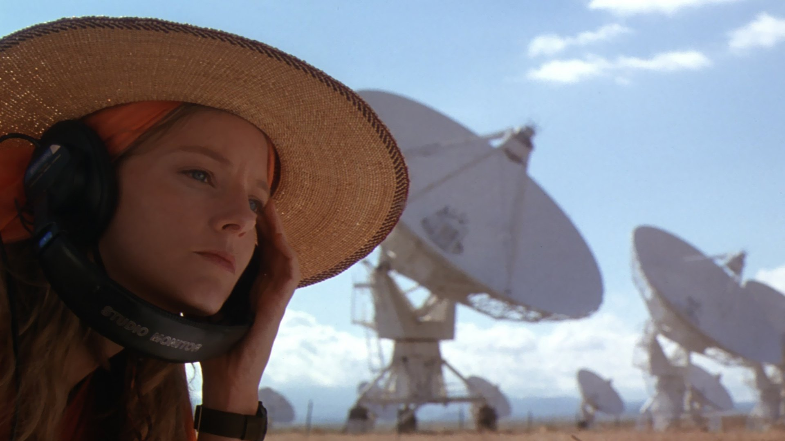

# verdant-shores 🏞️

A data acquisition software for the 40-foot radio telescope in the [National Radio Astronomy Observatory](https://public.nrao.edu/). This software is part of the [ERIRA](https://www.danreichart.com/erira) program. 

## Dependencies

We uses `PyQt5` for GUI and `pySerial` for communication to the data collection hardware (DataQ)

## Setting Up

Clone the repo and `cd` into it
```
$ git clone https://github.com/radiolevity/verdant-shores.git
$ cd verdant-shores/threepio/
```

`threepio` requires Python 3.7; we strongly recommend using a virtual environment, such as through [pipenv](https://pipenv-fork.readthedocs.io/en/latest/#install-pipenv-today)
```
$ pipenv install
```

Activate the virtual environment
```
$ pipenv shell
```

Verify that it is using the correct version (any 3.7.x is fine!)
```
$ python --version
Python 3.7.8
```

Run `threepio`
```
$ python threepio.py
```

## DataQ Resources
### Example Python Programs from DataQ

* DataQ Starter Kit [GitHub link](https://github.com/dataq-instruments/Python/blob/master/binary_comm/other_models/DataqStarterKit.py)

* Simple file [Github link](https://github.com/dataq-instruments/Simple-Python-Codes/blob/master/simpletest.py)

### Other References

* The DataQ device is in CDC mode (LED blinking yellow).
	* [Change to CDC](https://www.dataq.com/blog/data-acquisition/usb-daq-products-support-libusb-cdc/)

* A short introduction to [pySerial](https://pythonhosted.org/pyserial/shortintro.html)


